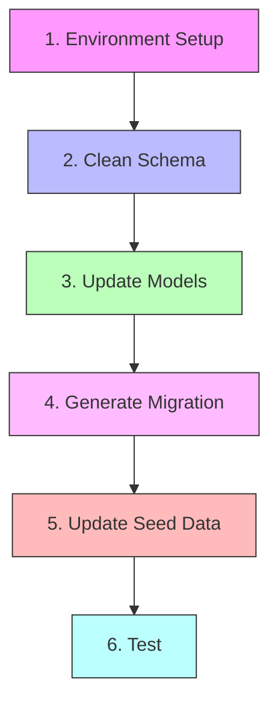

# Database Schema Management Guide

This guide provides step-by-step instructions for managing the database schema in the FastAPI template project.



## 1. Environment Setup

1. Ensure PostgreSQL is running
2. Update `.env` in project root:

```env
POSTGRES_SERVER=localhost
POSTGRES_USER=postgres
POSTGRES_PASSWORD=changethis
POSTGRES_DB=app
```

3. Copy `.env` to frontend:

```bash
cp .env frontend/.env
```

## 2. Clean Schema Setup

```bash
# Navigate to backend directory
cd backend

# Clear existing migrations (keep .keep file)
rm -f app/alembic/versions/*.py
touch app/alembic/versions/.keep

# Reset database
dropdb app
createdb app
```

## 3. Update Models

Edit `backend/app/models.py` to define your schema. Example:

```python
from sqlalchemy import Column, Integer, String, ForeignKey, Boolean
from sqlalchemy.orm import relationship
from app.core.db import Base

class User(Base):
    __tablename__ = "user"

    id = Column(Integer, primary_key=True, index=True)
    email = Column(String(256), unique=True, index=True, nullable=False)
    hashed_password = Column(String, nullable=False)
    is_active = Column(Boolean, default=True)
    is_superuser = Column(Boolean, default=False)
    items = relationship("Item", back_populates="owner")

class Item(Base):
    __tablename__ = "item"

    id = Column(Integer, primary_key=True, index=True)
    title = Column(String(256), index=True)
    description = Column(String)
    owner_id = Column(Integer, ForeignKey("user.id", ondelete="CASCADE"))
    owner = relationship("User", back_populates="items")
```

## 4. Generate & Apply Migration

```bash
# From backend directory
cd backend

# Generate initial migration
alembic revision --autogenerate -m "initialize_schema"

# Apply migration
alembic upgrade head

# Verify current migration
alembic current
```

## 5. Update Seed Data

1. Edit `backend/app/initial_data.py` to match your new schema
2. Run seed script:

```bash
# From backend directory
python -m app.initial_data
```

## 6. Testing

```bash
# From backend directory
./scripts/test.sh

# Start development servers
docker compose up -d
```

## Common Issues & Solutions

### Migration Conflicts

```bash
# Reset migrations
cd backend
rm -f app/alembic/versions/*.py
touch app/alembic/versions/.keep
alembic revision --autogenerate -m "fresh_start"
alembic upgrade head
```

### Database Connection Issues

```bash
# Check database connection
python backend/check_postgres.py

# Verify environment variables
cat .env

# Check PostgreSQL status
docker compose ps
```

### Data Inconsistencies

```bash
# Full reset
cd backend
dropdb app
createdb app
alembic upgrade head
python -m app.initial_data
```

## Project-Specific Best Practices

1. **Model Organization**

   - Keep models in `backend/app/models.py`
   - Use type hints for all fields
   - Document relationships between models
   - Use appropriate SQLAlchemy column types

2. **Migration Management**

   - Use descriptive migration names
   - One logical change per migration
   - Test migrations both up and down
   - Keep migrations in version control

3. **Seed Data**

   - Maintain minimal but functional test data
   - Update `initial_data.py` for each schema change
   - Include example of each model relationship
   - Add superuser account for testing

4. **Testing**
   - Update tests in `backend/app/tests/`
   - Add model-specific tests
   - Test API endpoints after schema changes
   - Verify frontend compatibility

## API Updates

When changing the schema, remember to update:

1. API Routes (`backend/app/api/routes/`)
2. CRUD Operations (`backend/app/crud.py`)
3. API Tests (`backend/app/tests/api/`)
4. Frontend Types (will be auto-generated)

## Frontend Integration

After schema changes:

1. Generate new API client:

```bash
./scripts/generate-client.sh
```

2. Update frontend components to match new schema
3. Update frontend tests
4. Test all affected features

## Deployment Considerations

1. Always backup production database before migrations
2. Test migrations on staging environment first
3. Plan for backward compatibility
4. Document breaking changes
5. Update deployment scripts if needed

## Quick Reference

```bash
# Full Reset
cd backend
rm -f app/alembic/versions/*.py
touch app/alembic/versions/.keep
dropdb app
createdb app
alembic revision --autogenerate -m "fresh_start"
alembic upgrade head
python -m app.initial_data

# Development Setup
docker compose up -d

# Generate Frontend Client
./scripts/generate-client.sh
```
