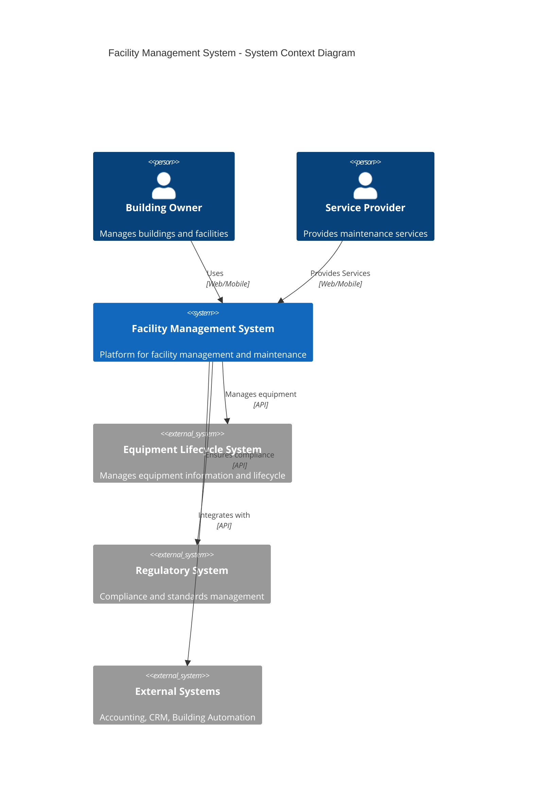
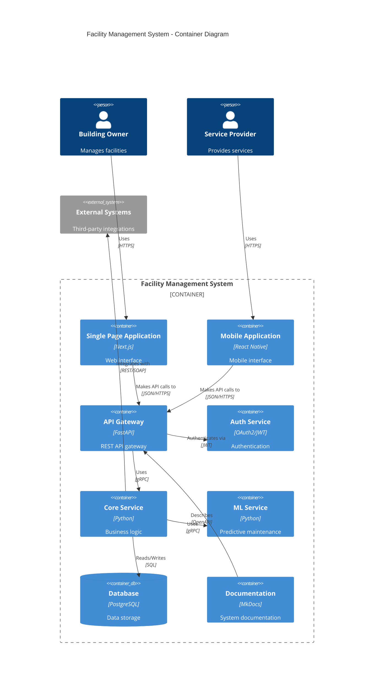
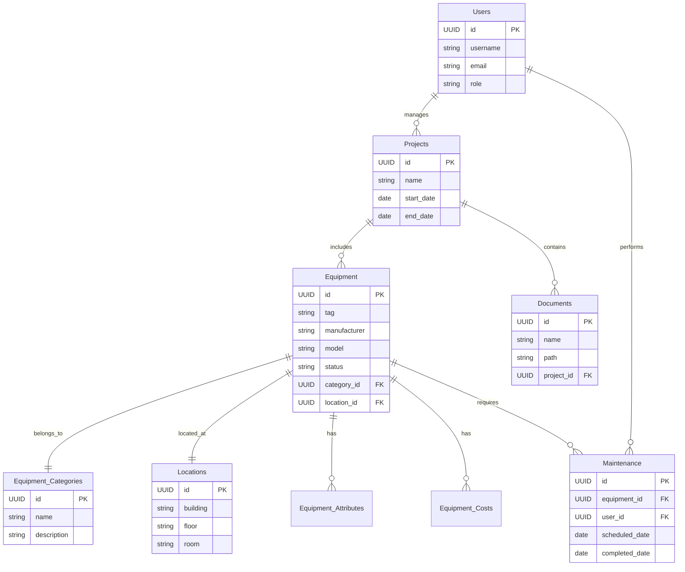

# Facility Management System Project Manual

## Table of Contents

1. [Project Overview](#project-overview)
2. [Architecture Overview](#architecture-overview)
3. [Domain Boundaries](#domain-boundaries)
4. [Database Schema Design](#database-schema-design)
5. [Implementation Architecture](#implementation-architecture)
6. [Technical Stack](#technical-stack)
7. [Data Access Patterns](#data-access-patterns)
8. [MVP Definition](#mvp-definition)
9. [Development Roadmap](#development-roadmap)

## Project Overview

### Project Intent

We're creating a scalable platform that connects building owners with service providers through an integrated system that tracks equipment, maintenance, projects, and costs. The system supports the entire lifecycle from initial estimation through ongoing maintenance, with clear visibility for all stakeholders.

### Technical Framework

The implementation is a modular monolith that can evolve over time, built with:

- NextJS and Tailwind CSS for the frontend
- FastAPI and Python for the backend
- PostgreSQL database with a well-defined schema
- Containerized deployment architecture
- Embedded machine learning for data transformation
- Test-driven development methodology
- Documentation-first approach

## Technical Stack

### Frontend

- **Framework**: Next.js 13+ with App Router for efficient server and client rendering
- **UI Components**: Tailwind CSS with shadcn/ui component library
- **State Management**: React Query for server state, Zustand for client state
- **Forms**: React Hook Form with Zod validation
- **Data Visualization**: Recharts for dashboards and equipment metrics
- **Maps/Spatial**: Mapbox GL JS for location visualization
- **Testing**: Jest with React Testing Library
- **API Client**: Axios with request/response interceptors

### Backend

- **Framework**: FastAPI with Pydantic for schema validation
- **ORM**: SQLAlchemy 2.0 with asyncio support
- **Migrations**: Alembic for versioned database migrations
- **Authentication**: OAuth 2.0 with JWT tokens and RBAC
- **Background Tasks**: Celery with Redis for task queuing
- **Real-time Updates**: WebSockets with SocketIO
- **API Documentation**: OpenAPI with Swagger UI
- **Testing**: pytest with pytest-asyncio and Factory Boy
- **Caching**: Redis for distributed caching
- **Validation**: Pydantic for input validation and data transformation

### Database

- **Primary Database**: PostgreSQL 15+ with PostGIS extension for spatial data
- **Migration Management**: Alembic for schema versioning and evolution
- **Time-Series Data**: TimescaleDB extension for sensor/IoT data (future)
- **Search**: PostgreSQL full-text search initially, with migration path to Elasticsearch
- **Database Access Patterns**: Repository pattern with Unit of Work

### DevOps

- **Containerization**: Docker with Docker Compose for development
- **Orchestration**: Kubernetes for production deployment
- **CI/CD**: GitHub Actions or GitLab CI
- **Infrastructure as Code**: Terraform
- **Monitoring**: Prometheus with Grafana dashboards
- **Logging**: ELK stack (Elasticsearch, Logstash, Kibana)
- **APM**: Sentry for error tracking and performance monitoring
- **Database Migrations**: Alembic integrated into CI/CD pipeline

### Machine Learning

- **Framework**: Scikit-learn for initial ML models
- **Deep Learning**: PyTorch (if needed for more complex models)
- **Feature Store**: Feast for feature management
- **Model Serving**: FastAPI with MLflow for model tracking
- **ETL**: Apache Airflow for data pipeline orchestration

### Security

- **Vulnerability Scanning**: SonarQube and dependency checking
- **Secrets Management**: HashiCorp Vault
- **Access Control**: OPA (Open Policy Agent) for fine-grained authorization
- **Compliance**: GDPR and ISO 27001 compliant design patterns

### Development Tools

- **IDE**: VSCode with Python and TypeScript extensions
- **API Testing**: Postman or Insomnia
- **Database Tools**: DBeaver or pgAdmin
- **Documentation**: MkDocs with Material theme
- **Dependency Management**: Poetry for Python, npm for JavaScript

### Core User Experiences

#### For Customers

- Portal for building owners to access equipment information
- Technical drawings and building specifications organized by project
- Maintenance request management
- Documentation access

#### For Employees (Role-specific interfaces)

- Service technicians: Equipment pricing and an Uber-like scheduling experience
- Estimators: Quick pricing tools based on UniFormat/MasterFormat specifications
- Preconstruction teams: Document review capabilities and standard management
- Project managers: Comprehensive project tracking for mechanical installations
- Operations staff: Submittal and documentation management tools

## Architecture Overview

### C4 Model Architecture

#### Level 1: System Context

```text
[Building Owners] --> [Facility Management System] <-- [Service Providers]
        |                       |                           |
        v                       v                           v
[External Systems]     [Equipment Lifecycle]     [Regulatory Standards]
```

#### Level 2: Container Architecture

The system is organized into several containers:

- Frontend Applications (NextJS + Tailwind CSS)
- API Layer (FastAPI)
- Database (PostgreSQL)
- ML Services (Python)
- Documentation System
- Authentication Service

These containers interact with Customer Portal, Employee Portal, and External Systems.

## Domain Boundaries

The system is organized into clearly defined domain boundaries following clean architecture principles:

### Core Domains

1. **Equipment Management Domain**
   - Equipment catalog and classification (UniFormat/MasterFormat)
   - Attributes and specifications management
   - Lifecycle tracking (installation, warranty, maintenance, EOL)
   - Location and asset hierarchy

2. **Project Management Domain**
   - Project planning and execution workflows
   - Resource allocation and scheduling
   - Budget tracking and financial management
   - Status reporting and milestone tracking

3. **Scheduling & Dispatch Domain**
   - Service technician assignment and routing
   - Calendar management and availability
   - Real-time status updates and notifications
   - SLA tracking and compliance

4. **Documentation Domain**
   - Technical document management
   - Version control and approval workflows
   - Submittal tracking and management
   - Standards and compliance documentation

### Supporting Domains

1. **Estimation Domain**
   - Pricing engine and algorithms
   - Standard templates and configurations
   - Historical data analysis
   - Quote generation and approval

2. **Building Information Domain**
   - Building specifications and metadata
   - Floor plans and spatial relationships
   - Equipment-to-location mapping
   - Building systems classification

3. **Analytics & Reporting Domain**
   - Performance metrics and KPIs
   - Cost analysis and TCO calculations
   - Predictive maintenance algorithms
   - Business intelligence dashboards

4. **Integration Services Domain**
   - External system connectors
   - Data transformation and mapping
   - API management and versioning
   - Event processing and messaging

### Interface Domains

1. **Customer Portal Domain**
   - User experience for building owners
   - Project visibility and reporting
   - Service request management
   - Documentation access and search

2. **Employee Portal Domain**
   - Role-based interfaces and workflows
   - Mobile-optimized experiences
   - Offline capabilities for field use
   - Collaboration and communication tools

3. **External API Domain**
   - Public and partner API endpoints
   - Authentication and rate limiting
   - Documentation and developer tools
   - Versioning and backward compatibility

4. **Security & Authentication Domain**
   - Identity management
   - Role-based access control
   - Audit logging and compliance
   - Data privacy and protection

## Database Schema Design

### Key Tables and Relationships

The database schema is organized around these core entities:

1. **Classification System**
   - OmniClass, UniFormat, MasterFormat, CatalogSystem, MCAA_Classifications
   - Junction tables for associating equipment categories with classifications

2. **Equipment**
   - Equipment table with core attributes
   - Equipment_Categories for classification
   - Equipment_Attributes for extensible properties
   - Equipment_TCO for lifecycle cost tracking

3. **Locations**
   - Building hierarchy (Building, Floor, Room)
   - Spatial coordinates

4. **Projects**
   - Projects and Project_Phases
   - Equipment_Projects for many-to-many relationship

5. **Documentation**
   - Document_Types for categorization
   - Equipment_Documents and Project_Documents

6. **Maintenance**
   - Maintenance tasks and history
   - Maintenance_Costs for tracking expenses

7. **Mapping System**
   - mapping_rules as the base
   - Specialized mapping types (pattern_rules, direct_mappings, etc.)
   - equipment_mappings for tracking applied rules

8. **Quality Control**
   - Quality_Control_Types for different verification processes
   - Quality_Control_Records for tracking verifications

9. **Users and Roles**
   - User management and authentication
   - Role-based access control

10. **Workflows**
    - Workflow definition and state management
    - Approval workflows and history tracking

11. **Integration**
    - External system connections
    - Data synchronization tracking

### Schema Strengths

- Comprehensive classification system support
- Strong equipment lifecycle tracking
- Sophisticated mapping system for data transformation
- Well-structured documentation system
- Predefined views for common access patterns

### Schema Enhancements

- User and role management
- Workflow management framework
- Event logging and notification system
- Integration management
- Enhanced spatial capabilities with PostGIS

## Implementation Architecture

### Project Structure

```text
src/
# Core Domain Modules
equipment/
    models.py       # Domain models for equipment
    repository.py   # Data access layer
    service.py      # Business logic
    api.py         # API endpoints
    schemas.py     # Data transfer objects
    events.py      # Domain events

project/
    models.py
    repository.py
    service.py
    api.py
    schemas.py
    events.py

scheduling/
    models.py
    repository.py
    service.py
    api.py
    schemas.py
    events.py

documentation/
    models.py
    repository.py
    service.py
    api.py
    schemas.py
    events.py

# Supporting Domain Modules
estimation/
    models.py
    repository.py
    service.py
    api.py
    schemas.py
    pricing_engine.py

building/
    models.py
    repository.py
    service.py
    api.py
    schemas.py
    spatial.py

analytics/
    models.py
    repository.py
    service.py
    api.py
    schemas.py
    reports.py
    ml_models.py

integration/
    models.py
    repository.py
    service.py
    api.py
    schemas.py
    connectors/
        building_automation.py
        accounting.py
        crm.py

# Interface Domain Modules
customer_portal/
    views.py
    forms.py
    components/
    pages/

employee_portal/
    views.py
    forms.py
    components/
    pages/
    role_specific/
        technician/
        estimator/
        project_manager/
        operations/

external_api/
    v1/
        endpoints.py
        schemas.py
        documentation.py

security/
    authentication.py
    authorization.py
    audit.py

# Shared Infrastructure
core/
    database.py
    logging.py
    config.py
    messaging.py
    cache.py

# Frontend Assets
frontend/
    components/
    shared/
    layout/
    forms/
    styles/
    hooks/
    pages/

# Testing
tests/
    unit/
    integration/
    e2e/
    fixtures/

# Deployment
deployment/
    docker/
        Dockerfile
        docker-compose.yml
    kubernetes/
        manifests/
    ci_cd/
        pipeline.yml
```

### API Design Patterns

  Each domain implements a consistent API structure:

- Repository Layer: Data access abstraction
- Service Layer: Business logic and cross-cutting concerns
- API Layer: REST endpoints with validation
- Schema Layer: Data transfer objects and validation
- Event System: Domain events for cross-domain communication

### Frontend Stack

- Framework: Next.js 13+ with App Router for efficient server and client rendering
- UI Components: Tailwind CSS with shadcn/ui component library
- State Management: React Query for server state, Zustand for client state
- Forms: React Hook Form with Zod validation
- Data Visualization: Recharts for dashboards and equipment metrics
- Maps/Spatial: Mapbox GL JS for location visualization
- Testing: Jest with React Testing Library
- API Client: Axios with request/response interceptors

### Backend Stack

- Framework: FastAPI with Pydantic for schema validation
- ORM: SQLAlchemy 2.0 with asyncio support
- Migrations: Alembic for versioned database migrations
- Authentication: OAuth 2.0 with JWT tokens and RBAC
- Background Tasks: Celery with Redis for task queuing
- Real-time Updates: WebSockets with SocketIO
- API Documentation: OpenAPI with Swagger UI
- Testing: pytest with pytest-asyncio and Factory Boy
- Caching: Redis for distributed caching
- Validation: Pydantic for input validation and data transformation

### Database Stack

- Primary Database: PostgreSQL 15+ with PostGIS extension for spatial data
- Migration Management: Alembic for schema versioning and evolution
- Time-Series Data: TimescaleDB extension for sensor/IoT data (future)
- Search: PostgreSQL full-text search initially, with migration path to Elasticsearch
- Database Access Patterns: Repository pattern with Unit of Work

### DevOps Stack

- Containerization: Docker with Docker Compose for development
- Orchestration: Kubernetes for production deployment
- CI/CD: GitHub Actions or GitLab CI
- Infrastructure as Code: Terraform
- Monitoring: Prometheus with Grafana dashboards
- Logging: ELK stack (Elasticsearch, Logstash, Kibana)
- APM: Sentry for error tracking and performance monitoring
- Database Migrations: Alembic integrated into CI/CD pipeline

### Machine Learning Stack

- Framework: Scikit-learn for initial ML models
- Deep Learning: PyTorch (if needed for more complex models)
- Feature Store: Feast for feature management
- Model Serving: FastAPI with MLflow for model tracking
- ETL: Apache Airflow for data pipeline orchestration

### Security Stack

- Vulnerability Scanning: SonarQube and dependency checking
- Secrets Management: HashiCorp Vault
- Access Control: OPA (Open Policy Agent) for fine-grained authorization
- Compliance: GDPR and ISO 27001 compliant design patterns

### Development Tools Stack

- IDE: VSCode with Python and TypeScript extensions
- API Testing: Postman or Insomnia
- Database Tools: DBeaver or pgAdmin
- Documentation: MkDocs with Material theme
- Dependency Management: Poetry for Python, npm for JavaScript

## MVP Definition

### Core Vision

The Minimum Viable Product (MVP) for the Facility Management System will deliver a focused solution that connects building owners with service providers through a unified platform for equipment lifecycle management. The MVP will establish the foundation for future growth while delivering immediate value to key stakeholders.

### MVP Goals

1. Establish a comprehensive equipment database with classification and attribute management
2. Enable basic workflow management for maintenance and documentation
3. Provide separate portals for customers and employees with role-specific functionality
4. Implement core reporting on equipment status and maintenance history
5. Support document management for equipment and projects

### MVP Scope by Domain

#### 1. Equipment Management Domain (CORE)

In Scope:

- Equipment database with standard classifications (UniFormat/MasterFormat)
- Equipment attributes and specifications management
- Basic location tracking and assignment
- Equipment categorization and search

Out of Scope for MVP:

- Advanced IoT integration
- Predictive maintenance algorithms
- 3D visualization of equipment
- Real-time monitoring

#### 2. Project Management Domain (CORE)

In Scope:

- Basic project creation and tracking
- Equipment-to-project associations
- Simple project phases and milestones
- Project documentation management

Out of Scope for MVP:

- Advanced project planning tools
- Resource allocation optimization
- Gantt chart visualization
- Budget forecasting

#### 3. Scheduling & Dispatch Domain (CORE)

In Scope:

- Maintenance task creation and assignment
- Basic calendar view for technicians
- Service history tracking
- Work order management

Out of Scope for MVP:

- Route optimization
- Real-time location tracking of technicians
- Automated scheduling algorithms
- Mobile offline functionality

#### 4. Documentation Domain (CORE)

In Scope:

- Document upload and categorization
- Basic version control
- Document search and retrieval
- Association with equipment and projects

Out of Scope for MVP:

- Advanced document workflows and approvals
- OCR and content extraction
- AI-powered document classification
- Automated submittal processing

#### 5. Customer Portal Domain (INTERFACE)

In Scope:

- Equipment inventory view
- Basic maintenance request submission
- Document access for owned equipment
- Simple project status dashboard

Out of Scope for MVP:

- Advanced analytics and cost tracking
- Custom reporting tools
- Integration with customer's existing systems
- Mobile app version

#### 6. Employee Portal Domain (INTERFACE)

In Scope:

- Role-based dashboards (technicians, estimators, project managers)
- Equipment and project search
- Work order management
- Basic document access

Out of Scope for MVP:

- Advanced workflow tools
- Custom reporting builders
- Mobile-optimized interfaces
- Offline capabilities

#### 7. Security & Authentication Domain (INTERFACE)

In Scope:

- User authentication and basic authorization
- Role-based access control
- Session management
- Password reset functionality

Out of Scope for MVP:

- Single sign-on (SSO)
- Multi-factor authentication
- Advanced audit logging
- Fine-grained permission management

### Technical MVP Scope

#### Database & Data Model

In Scope:

- Core schema implementation for all domains
- Basic migration setup with Alembic
- Initial data seeding for classifications and reference data
- PostgreSQL with basic spatial support

Out of Scope for MVP:

- Advanced PostGIS functionality
- Data partitioning strategies
- Multi-tenancy architecture
- Advanced caching mechanisms

#### API & Backend

In Scope:

- RESTful API for all core domains
- Basic validation and error handling
- Authentication and simple authorization
- Core business logic implementation

Out of Scope for MVP:

- GraphQL API
- Advanced rate limiting and throttling
- Comprehensive analytics endpoints
- Machine learning integrations

#### Frontend Scope

In Scope:

- Responsive web interface for both portals
- Core CRUD operations for all entities
- Basic search and filtering
- Simple dashboards and visualizations

Out of Scope for MVP:

- Advanced data visualization
- Complex interactive features
- Offline capabilities
- Mobile app versions

#### Infrastructure & DevOps

In Scope:

- Docker containerization
- Basic CI/CD pipeline
- Development, staging, and production environments
- Simple monitoring and logging

Out of Scope for MVP:

- Kubernetes orchestration
- Auto-scaling capabilities
- Advanced observability
- Disaster recovery automation

### MVP Development Phases

#### Phase 1: Foundation (Weeks 1-4)

- Database schema implementation
- Core domain model development
- Basic API endpoints
- Authentication system

#### Phase 2: Core Functionality (Weeks 5-8)

- Equipment management features
- Documentation system
- Project management basics
- Maintenance scheduling

#### Phase 3: User Interfaces (Weeks 9-12)

- Customer portal development
- Employee portal implementation
- Role-based dashboards
- Basic search and filtering

#### Phase 4: Integration & Testing (Weeks 13-16)

- End-to-end testing
- Performance optimization
- User acceptance testing
- Documentation and training materials

### MVP Success Criteria

1. User Adoption: Both customers and employees actively use the system
2. Data Management: Complete equipment records with proper classification
3. Workflow Efficiency: Measurable reduction in maintenance coordination time
4. Documentation: Improved access to equipment and project documentation
5. Stability: System performs reliably with acceptable response times

## Development Roadmap

### Phase 1: MVP Development (Months 1-4)

- Implement core functionality as defined in MVP scope
- Establish basic infrastructure and deployment pipeline
- Develop customer and employee portals with essential features
- Complete data model and database implementation

### Phase 2: Enhancement & Stabilization (Months 5-8)

- Add workflow management capabilities
- Implement document versioning and approval flows
- Enhance search and filtering capabilities
- Improve user experience based on initial feedback
- Strengthen security and access control

### Phase 3: Advanced Features (Months 9-12)

- Implement predictive maintenance capabilities
- Add advanced reporting and dashboards
- Develop mobile-optimized interfaces
- Integrate with common external systems (BMS, ERP)
- Add TCO calculators and lifecycle planning tools

### Phase 4: Scaling & Extension (Year 2)

- Implement IoT integration for equipment monitoring
- Add marketplace capabilities for service providers
- Develop advanced analytics and ML features
- Support multi-tenant architecture
- Create developer API and extension ecosystem

## Architecture Patterns and Best Practices

### Domain-Driven Design (DDD)

- Each domain has clearly defined boundaries
- Ubiquitous language shared across development team
- Entities, value objects, and aggregates properly defined
- Repository pattern for data access

### Clean Architecture

- Dependencies point inward
- Domain logic isolated from infrastructure concerns
- Use cases define application behavior
- External interfaces are interchangeable

### Event-Driven Architecture

- Domain events for cross-domain communication
- Event sourcing for critical state changes
- Message broker for reliable event delivery
- Event handlers for decoupled processing

### CQRS (Command Query Responsibility Segregation)

- Separate command and query models
- Optimized read models for reporting
- Event sourcing for command side
- Eventual consistency between models

### Repository Pattern

- Data access abstraction
- Domain-focused query methods
- Transaction management at service layer
- Unit testable data access

### TDD (Test-Driven Development)

- Write tests before implementation
- Focus on behavior, not implementation details
- Fast feedback cycle
- High test coverage for core domains

## Database Management

### Schema Evolution Strategy

- Use Alembic for versioned migrations
- Forward and backward compatibility
- Database refactoring patterns
- Data migration scripts

### Performance Optimization

- Appropriate indexing strategy
- Query optimization
- Connection pooling
- Caching strategy for frequent data

### Data Integrity

- Constraints and validation
- Transactional boundaries
- Optimistic concurrency
- Audit logging

### Backup and Recovery

- Regular automated backups
- Point-in-time recovery
- Disaster recovery testing
- Data retention policies

## Security Considerations

### Authentication and Authorization

- OAuth 2.0 with JWT tokens
- Role-based access control (RBAC)
- Permission management
Session handling

### Data Protection

- Encryption at rest and in transit
- PII handling best practices
- Data minimization principles
- Secure API endpoints

### Audit and Compliance

- Comprehensive activity logging
- Regulatory compliance (if applicable)
- Security monitoring
- Vulnerability management

### DevSecOps

- Security scanning in CI/CD pipeline
- Dependency vulnerability checks
- Container security
- Infrastructure security

## Frontend Architecture

### Component Design

- Reusable UI component library
- Consistent styling with Tailwind
- Accessible design patterns
- Responsive layouts

### State Management

- React Query for server state
- Zustand for client state
- Context API for theme and user state
- Form state with React Hook Form

### Performance Optimization Frontend

- Code splitting
- Lazy loading
- Memoization
- Image optimization

### Testing Strategy

- Component testing with Jest and React Testing Library
- End-to-end testing with Cypress
- Accessibility testing
- Visual regression testing

## Deployment and Operations

### Containerization

- Docker for application packaging
- Docker Compose for development
- Container registry management
- Base image security

### CI/CD Pipeline

- Automated testing
- Linting and static analysis
- Database migrations
- Deployment automation

### Environment Management

- Development, staging, production environments
- Feature flags for controlled rollout
- Configuration management
- Secrets management

### Monitoring and Observability

- Application performance monitoring
- Error tracking
- Logging strategy
- Alerting and incident management

## Integration Strategies

### External System Integration

- API-based integration
- Webhook support
- ETL processes
- Message-based integration

### Data Synchronization

- Incremental sync patterns
- Conflict resolution
- Batch processing
- Real-time updates

### API Management

- Versioning strategy
- Documentation with OpenAPI
- Rate limiting and throttling
- Analytics and usage tracking

## Quality Assurance

### Testing Pyramid

- Unit testing for business logic
- Integration testing for repositories
- API testing for endpoints
- End-to-end testing for critical flows

### Performance Testing

- Load testing
- Stress testing
- Scalability testing
- Database performance

### Security Testing

- OWASP compliance
- Penetration testing
- Vulnerability scanning
- Code security review

### Accessibility Testing

- WCAG 2.1 compliance
- Screen reader compatibility
- Keyboard navigation
- Color contrast

## Documentation

### Code Documentation

- Docstrings for public APIs
- Architectural Decision Records (ADRs)
- README files for each module
- Code standards and guidelines

### User Documentation

- User manuals
- Video tutorials
- In-app help system
- FAQs and knowledge base

### API Documentation

- OpenAPI specification
- Usage examples
- Authentication guide
- Rate limiting details

### Operations Documentation

- Deployment procedures
- Backup and recovery
- Troubleshooting guides
- Monitoring guidelines

## Team Structure and Collaboration

### Development Teams

- Cross-functional teams by domain
- Shared infrastructure team
- UX/UI specialists
- QA engineers

### Development Process

- Agile methodology (Scrum/Kanban)
- Sprint planning and retrospectives
- Continuous integration
- Peer code reviews

### Communication Channels

- Daily standups
- Documentation in wiki
- Asynchronous communication tools
- Knowledge sharing sessions

### Knowledge Management

- Centralized documentation
- Onboarding process
- Technical decision records
- Shared design system

## Appendices

### A. Database Schema Details

- Complete schema documentation
- Entity-relationship diagrams
- Migration history
- Data dictionary

### B. API Reference

- Endpoint specifications
- Request/response examples
- Error codes
- Rate limits

### C. Environment Setup

- Development environment setup
- Local testing instructions
- Database seeding
- Mock data generation

### D. Glossary

- Domain-specific terminology
- Technical terms
- Acronyms
- Classification system references

### E. Reference Implementations

- Sample code snippets
- Pattern implementations
- Testing examples
Configuration templates

### F. Diagrams

## C4 Architecture Diagrams (Mermaid)

### Level 1: System Context Diagram (Mermaid)



**Explanation:**

- **`C4Context`**:  Defines the diagram type as a context diagram.
- **`Person`**: Represents external actors - Building Owners and Service Providers.
- **`System`**:  Represents the main system - Facility Management System and external/contextual systems.
- **`System_Ext`**: Groups related systems into boundaries to provide context.
- **`Rel`**: Define relationships between elements (both direct and directional dotted lines for data flow/dependency).
- **`UpdateLayoutConfig`**:  Minor configuration for better visual presentation (optional).

### Level 2: Container Diagram (Mermaid)



**Explanation:**

- **`C4Container`**: Defines the diagram type as a container diagram.
- **`Container`**: Represents software containers (Frontend Apps, API Layer, ML Services, Documentation, Auth).
- **`ContainerDb`**:  Specifically for the Database container, denoting it as a database.
- **`SystemBoundary`**: Encloses all containers within the "Facility Management System".
- **`System_Ext`**: Groups relationships relevant to specific interfaces (External Systems) for clarity.
- Relationships show interactions and technology details.

### Level 3: Entity-Relationship Diagram (ERD) - Simplified (Mermaid)

This ERD focuses on the core entities. For a truly comprehensive ERD, you'd need to represent *all* tables and relationships, which can be very large and less readable in a project manual overview.  This simplified version highlights the key entities and their connections.



**Explanation:**

- **`erDiagram`**:  Defines the diagram type as an ER Diagram.
- **Entities**:  Represented as boxes (e.g., `Equipment`, `Locations`, `Projects`).  Key attributes and PK/FK (Primary Key, Foreign Key) are listed.
- **Relationships**:  Lines between entities show relationships.  Mermaid ER syntax uses symbols to denote cardinality (||-one-to-one, |o-one-to-many, o{-many-to-many).  Descriptive labels are added to relationships (e.g., "belongs_to", "located_at").
- **Styling**: Basic styling is added for visual grouping of entities (Equipment in a prominent color, categories/locations in another, etc.). Styling is optional but improves readability.

**How to Use in your Project Manual:**

1. **Mermaid Live Editor or Integrations:**  You can copy and paste these Mermaid code blocks into:
      - The online [Mermaid Live Editor](https://www.google.com/url?sa=E&source=gmail&q=https://mermaid.live/).
      - Tools that support Mermaid (e.g.,  many Markdown editors, Confluence, Jira, GitHub Markdown, GitLab Markdown, VS Code with Mermaid extensions).
2. **Image Export (if needed):** If your manual format doesn't directly render Mermaid, you can use the Live Editor to export the diagrams as SVG, PNG, or other image formats and embed those images in your document.

**Important Notes:**

- **ER Diagram Scope:** This ER diagram is simplified for overview purposes. A full technical database documentation would likely require a more detailed ERD.
- **C4 Level 3 (Components - Optional):**  For even deeper architectural documentation, you *could* create a C4 Level 3 "Component Diagram" for key containers like the "API Layer" or "Frontend Applications," showing the major components (e.g., within the API Layer: `Equipment API`, `Project API`, `Auth API`, `Service Layer`, `Repository Layer`). Let me know if you'd like an example of a Level 3 component diagram in Mermaid.
- **Iterative Refinement:**  Diagrams are living documents. As your project evolves, you'll likely need to update these diagrams to keep them accurate and reflect the current architecture and data model.

## Data Access Patterns

### Database Configuration and Connection

```python
# core/database.py
from sqlalchemy import create_engine
from sqlalchemy.ext.declarative import declarative_base
from sqlalchemy.orm import sessionmaker
from sqlalchemy.pool import QueuePool
from contextlib import contextmanager
from core.config import settings

# Base class for all SQLAlchemy models
Base = declarative_base()

# Create engine with connection pooling
engine = create_engine(
    settings.DATABASE_URL,
    poolclass=QueuePool,
    pool_size=10,
    max_overflow=20,
    pool_timeout=30,
    pool_recycle=1800  # Recycle connections after 30 min
)

# Session factory
SessionLocal = sessionmaker(
    autocommit=False,
    autoflush=False,
    bind=engine
)

# Context manager for database sessions
@contextmanager
def get_db():
    db = SessionLocal()
    try:
        yield db
        db.commit()
    except:
        db.rollback()
        raise
    finally:
        db.close()
```

### Alembic Configuration for Migrations

```python
# alembic/env.py (key parts)
from alembic import context
from sqlalchemy import engine_from_config, pool
from logging.config import fileConfig

from core.database import Base
from core.config import settings

# Import all models to ensure they're registered with Base.metadata
from equipment.models import *
from project.models import *
from scheduling.models import *
from documentation.models import *

config = context.config
config.set_main_option("sqlalchemy.url", settings.DATABASE_URL)

# Run migrations for specific domain schemas by setting target_metadata
target_metadata = Base.metadata

def run_migrations_online():
    connectable = engine_from_config(
        config.get_section(config.config_ini_section),
        prefix="sqlalchemy.",
        poolclass=pool.NullPool,
    )

    with connectable.connect() as connection:
        context.configure(
            connection=connection,
            target_metadata=target_metadata,
            # Support for schema versioning by domain
            include_schemas=True,
            version_table_schema="public",
            # Comparison settings for migrations
            compare_type=True,
            compare_server_default=True
        )

        with context.begin_transaction():
            context.run_migrations()
```

### Repository Pattern Implementation

```python
# equipment/repository.py
from sqlalchemy.orm import Session
from sqlalchemy import select, func
from typing import List, Optional
from uuid import UUID

from equipment.models import Equipment, EquipmentAttributes, EquipmentCosts
from equipment.schemas import EquipmentCreate, EquipmentUpdate

class EquipmentRepository:
    """Repository for Equipment domain entities"""

    def __init__(self, db: Session):
        self.db = db

    def get_by_id(self, equipment_id: UUID) -> Optional[Equipment]:
        """Get equipment by ID with related attributes"""
        query = select(Equipment).where(Equipment.EquipmentID == equipment_id)
        return self.db.execute(query).scalars().first()

    def get_with_attributes(self, equipment_id: UUID) -> Optional[Equipment]:
        """Get equipment with eager loading of attributes"""
        query = select(Equipment).where(
            Equipment.EquipmentID == equipment_id
        ).options(
            joinedload(Equipment.attributes)
        )
        return self.db.execute(query).scalars().first()

    def list_equipment(
        self,
        skip: int = 0,
        limit: int = 100,
        category_id: Optional[int] = None,
        location_id: Optional[int] = None,
        status: Optional[str] = None
    ) -> List[Equipment]:
        """List equipment with filtering options"""
        query = select(Equipment)

        # Apply filters if provided
        if category_id:
            query = query.where(Equipment.CategoryID == category_id)
        if location_id:
            query = query.where(Equipment.LocationID == location_id)
        if status:
            query = query.where(Equipment.Status == status)

        # Apply pagination
        query = query.offset(skip).limit(limit)

        return self.db.execute(query).scalars().all()

    def create(self, data: EquipmentCreate) -> Equipment:
        """Create new equipment record"""
        equipment = Equipment(**data.dict(exclude={"attributes"}))
        self.db.add(equipment)
        self.db.flush()  # To get the ID while staying in transaction

        # Create associated attributes if provided
        if data.attributes:
            for attr in data.attributes:
                equipment_attr = EquipmentAttributes(
                    EquipmentID=equipment.EquipmentID,
                    **attr.dict()
                )
                self.db.add(equipment_attr)

        return equipment

    def update(self, equipment_id: UUID, data: EquipmentUpdate) -> Optional[Equipment]:
        """Update equipment record"""
        equipment = self.get_by_id(equipment_id)
        if not equipment:
            return None

        # Update direct fields
        for key, value in data.dict(exclude={"attributes"}, exclude_unset=True).items():
            setattr(equipment, key, value)

        # Handle attributes if provided
        if data.attributes:
            existing_attrs = {attr.AttributeName: attr for attr in equipment.attributes}

            for attr_data in data.attributes:
                if attr_data.AttributeName in existing_attrs:
                    # Update existing
                    attr = existing_attrs[attr_data.AttributeName]
                    attr.AttributeValue = attr_data.AttributeValue
                    attr.UnitOfMeasure = attr_data.UnitOfMeasure
                else:
                    # Create new
                    new_attr = EquipmentAttributes(
                        EquipmentID=equipment_id,
                        **attr_data.dict()
                    )
                    self.db.add(new_attr)

        return equipment

    def delete(self, equipment_id: UUID) -> bool:
        """Delete equipment record"""
        equipment = self.get_by_id(equipment_id)
        if not equipment:
            return False

        self.db.delete(equipment)
        return True

    def get_equipment_with_costs(self, equipment_id: UUID) -> Optional[dict]:
        """Get equipment with cost analysis"""
        equipment = self.get_by_id(equipment_id)
        if not equipment:
            return None

        # Get total costs by type
        cost_query = select(
            EquipmentCosts.CostType,
            func.sum(EquipmentCosts.Amount).label("total_amount")
        ).where(
            EquipmentCosts.EquipmentID == equipment_id
        ).group_by(
            EquipmentCosts.CostType
        )

        costs_by_type = {
            row.CostType: row.total_amount
            for row in self.db.execute(cost_query).all()
        }

        return {
            "equipment": equipment,
            "costs": costs_by_type,
            "total_cost": sum(costs_by_type.values())
        }
```

### Common SQL Access Patterns

#### Equipment Search and Filtering

```sql
-- Search equipment with multiple filters
SELECT e.EquipmentID, e.EquipmentTag, e.Manufacturer, e.Model, e.Status,
       ec.CategoryName, l.BuildingName, l.Floor, l.Room
FROM Equipment e
JOIN Equipment_Categories ec ON e.CategoryID = ec.CategoryID
JOIN Locations l ON e.LocationID = l.LocationID
WHERE (ec.CategoryID = :category_id OR :category_id IS NULL)
  AND (l.BuildingName = :building_name OR :building_name IS NULL)
  AND (e.Status = :status OR :status IS NULL)
  AND (e.Manufacturer ILIKE :search OR e.Model ILIKE :search OR e.EquipmentTag ILIKE :search
       OR :search IS NULL)
ORDER BY e.EquipmentTag
LIMIT :limit OFFSET :offset;
```

#### Equipment Detail with Attributes

```sql
-- Get complete equipment details with attributes
SELECT e.*,
       json_agg(
           json_build_object(
               'AttributeName', ea.AttributeName,
               'AttributeValue', ea.AttributeValue,
               'UnitOfMeasure', ea.UnitOfMeasure
           )
       ) as attributes
FROM Equipment e
LEFT JOIN Equipment_Attributes ea ON e.EquipmentID = ea.EquipmentID
WHERE e.EquipmentID = :equipment_id
GROUP BY e.EquipmentID;
```
