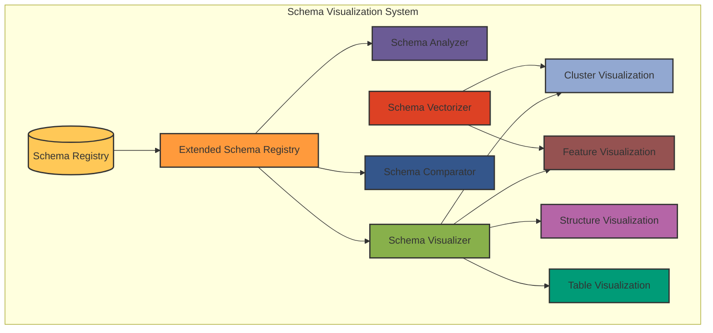
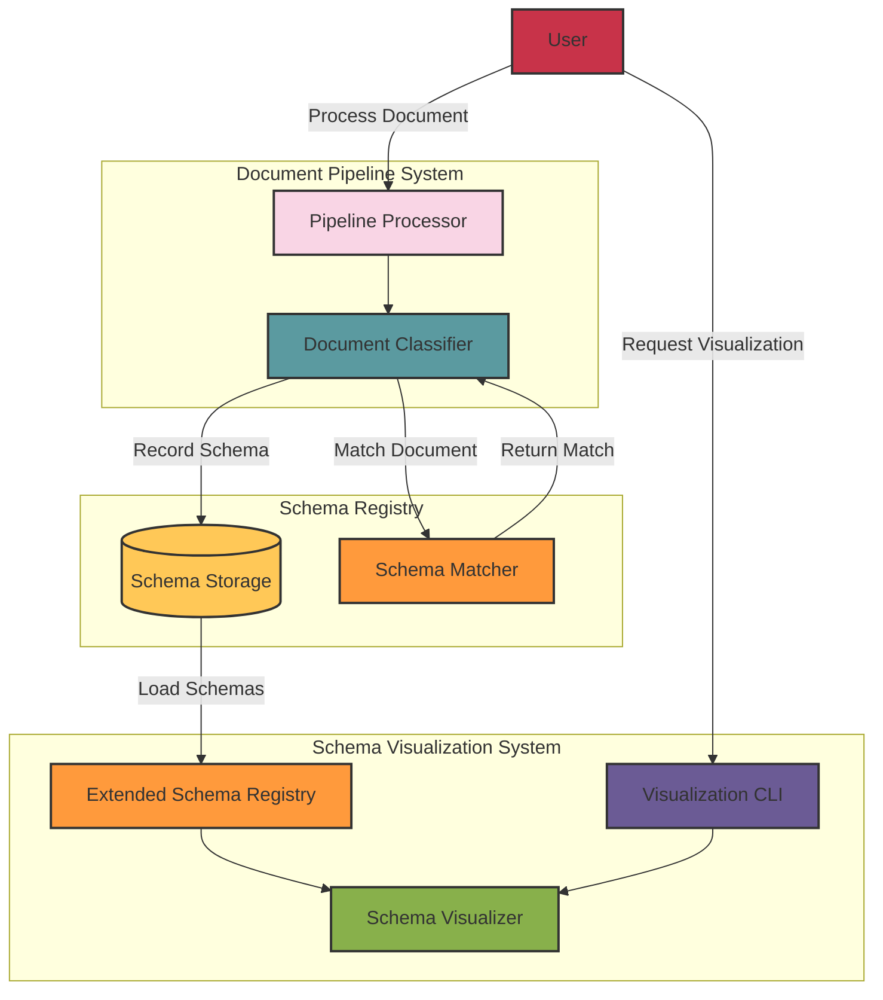
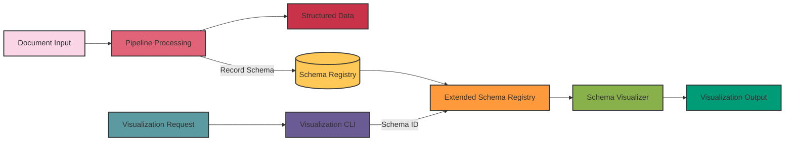
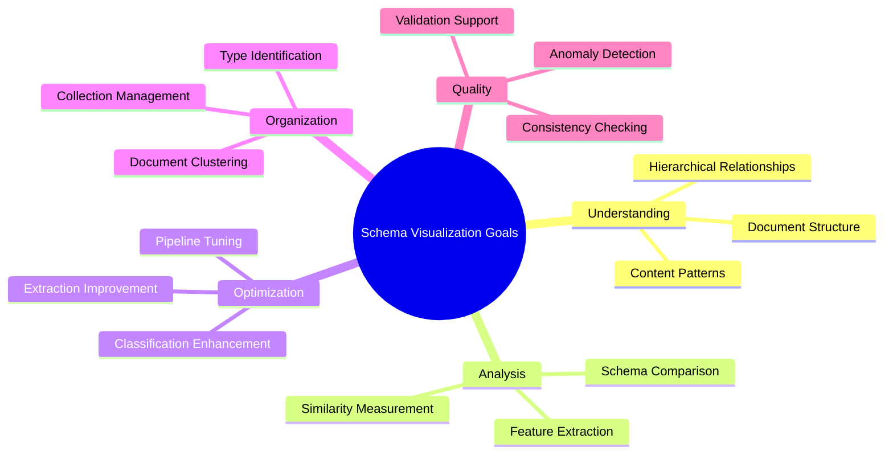

# System Diagrams

This document provides visual diagrams of the Document Pipeline Tool and Schema Visualization systems, along with explanations of how they interact.

## Pipeline System Architecture

The Document Pipeline Tool follows a sequential processing approach to extract structured data from various document formats.

```mermaid
flowchart TD
    subgraph "Document Pipeline System"
        Input[Document Input] --> Analyzer
        Analyzer[1. Document Analyzer] --> Cleaner
        Cleaner[2. Content Cleaner] --> Extractor
        Extractor[3. Data Extractor] --> Validator
        Validator[4. Data Validator] --> Classifier
        Classifier[5. Document Classifier] --> Formatter
        Formatter[6. Output Formatter] --> Verifier
        Verifier[7. Output Verifier] --> Output[Structured Output]
        
        SchemaReg[(Schema Registry)]
        Classifier -- Record Schema --> SchemaReg
        Classifier -- Match Schema --> SchemaReg
    end
    
    style Analyzer fill:#f9d5e5,stroke:#333,stroke-width:2px
    style Cleaner fill:#eeac99,stroke:#333,stroke-width:2px
    style Extractor fill:#e06377,stroke:#333,stroke-width:2px
    style Validator fill:#c83349,stroke:#333,stroke-width:2px
    style Classifier fill:#5b9aa0,stroke:#333,stroke-width:2px
    style Formatter fill:#d6e1c7,stroke:#333,stroke-width:2px
    style Verifier fill:#88b04b,stroke:#333,stroke-width:2px
    style SchemaReg fill:#ffc857,stroke:#333,stroke-width:2px
```

### Pipeline Components

1. **Document Analyzer**: Examines the document structure and extracts metadata
2. **Content Cleaner**: Normalizes and standardizes document content
3. **Data Extractor**: Extracts structured data from the cleaned content
4. **Data Validator**: Validates the extracted data against expected schemas
5. **Document Classifier**: Identifies document type and matches against known schemas
6. **Output Formatter**: Formats the validated data into the desired output format
7. **Output Verifier**: Verifies the structure of the formatted output
8. **Schema Registry**: Stores and manages document schemas for classification and matching

## Schema Visualization System

The Schema Visualization system provides tools for visualizing and analyzing document schemas stored in the Schema Registry.

### Schema Visualization Components

1. **Schema Registry**: Core storage for document schemas
2. **Extended Schema Registry**: Extends the base registry with analysis and visualization capabilities
3. **Schema Analyzer**: Analyzes schemas to identify patterns and characteristics
4. **Schema Visualizer**: Generates visual representations of schemas
5. **Schema Comparator**: Compares schemas to identify similarities and differences
6. **Schema Vectorizer**: Converts schemas to numerical vectors for analysis
7. **Visualization Types**:
   - **Cluster Visualization**: Shows schema similarity using dimensionality reduction
   - **Feature Visualization**: Compares schema features across documents
   - **Structure Visualization**: Displays hierarchical structure of schemas
   - **Table Visualization**: Shows table patterns within schemas

## System Interaction

The Pipeline and Schema Visualization systems interact primarily through the Schema Registry, which serves as a shared data store.

### Key Interactions

1. **Schema Recording**: The Pipeline's Document Classifier records document schemas to the Schema Registry
2. **Schema Matching**: The Pipeline matches new documents against known schemas in the registry
3. **Schema Loading**: The Extended Schema Registry loads schemas from the Schema Registry for visualization
4. **User Interaction**: Users interact with both systems - processing documents through the Pipeline and requesting visualizations through the CLI

## Data Flow Diagram

This diagram shows the flow of data through both systems, from document input to visualization output.

## Goal of the Schema Visualization Tool

The Schema Visualization Tool serves several important purposes:

1. **Understanding Document Structures**: Helps users understand the structure and patterns in their document collections by visualizing schema characteristics.

2. **Document Classification Improvement**: Provides insights that can be used to improve document classification by identifying distinguishing features between document types.

3. **Schema Pattern Discovery**: Reveals patterns and relationships between different document schemas that might not be apparent from examining the raw data.

4. **Quality Assurance**: Helps identify outliers or anomalies in document processing that might indicate issues with the extraction process.

5. **Document Type Clustering**: Automatically groups similar document types based on their schema characteristics, which can help in organizing large document collections.

6. **Schema Evolution Tracking**: Allows tracking how document schemas evolve over time as new documents are processed.

7. **Processing Pipeline Optimization**: Provides feedback that can be used to optimize the document processing pipeline for specific document types.

In summary, the Schema Visualization Tool transforms abstract schema data into intuitive visual representations that help users understand, analyze, and optimize their document processing workflows. It bridges the gap between the technical aspects of document processing and the human need for visual pattern recognition and insight discovery.
