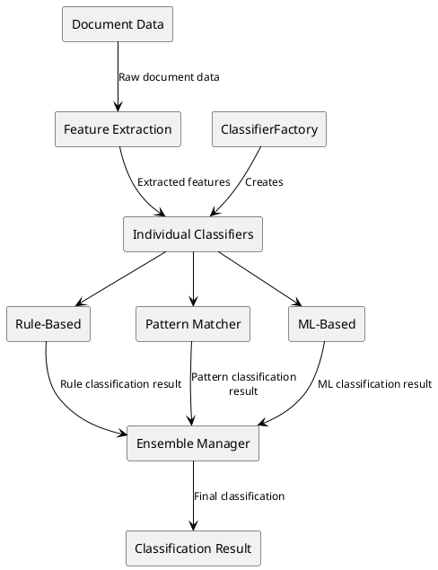
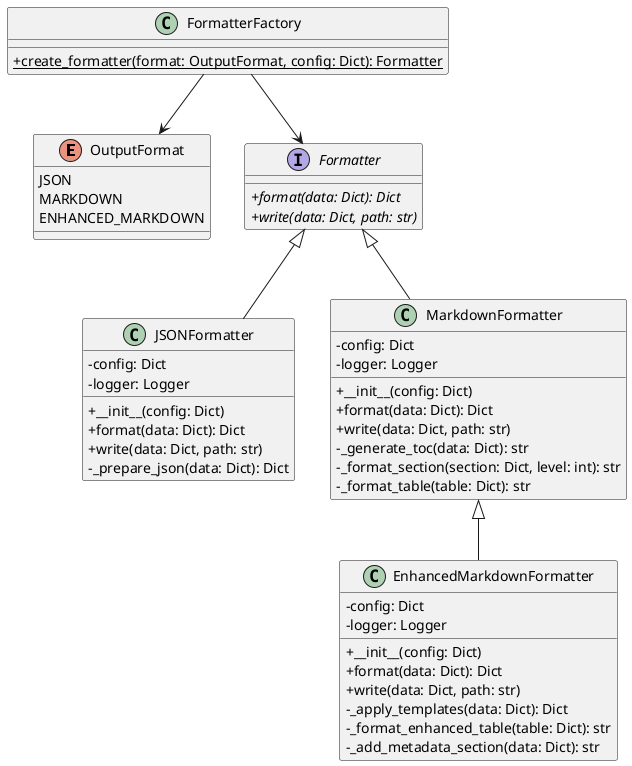
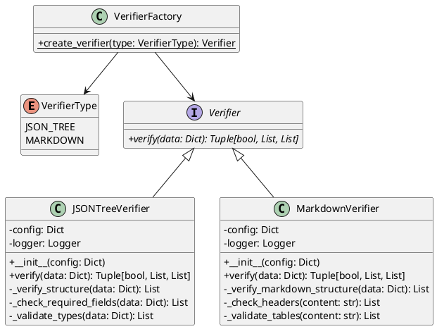
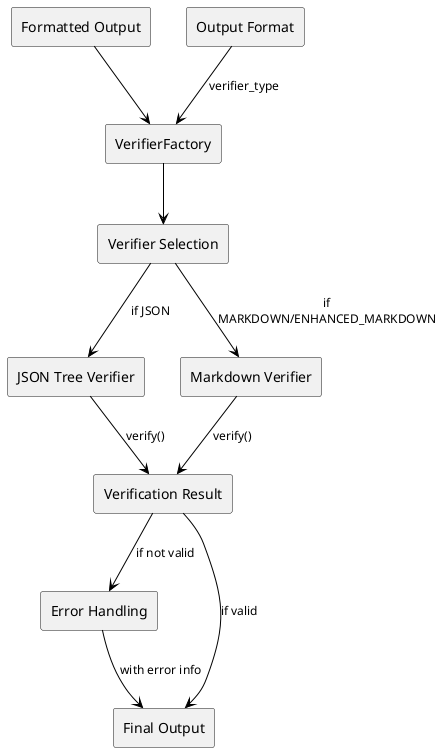
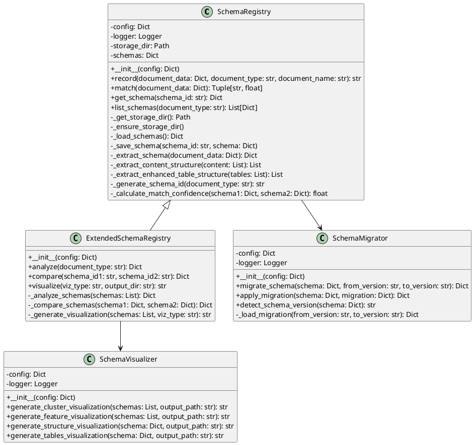
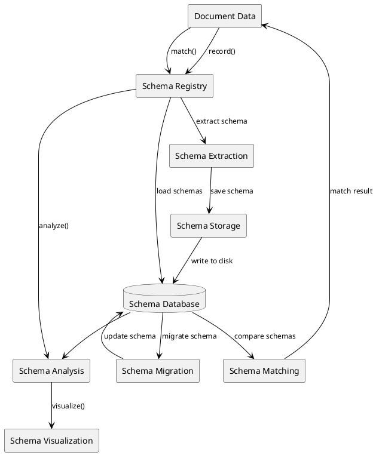
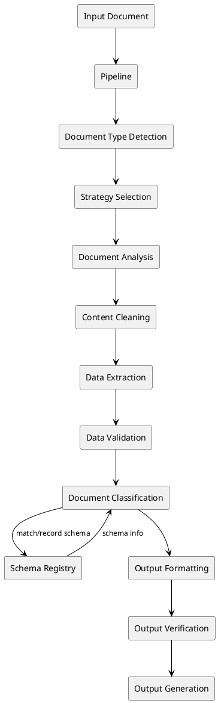

# Pipeline Component Diagrams

This file contains detailed diagrams for key components of the pipeline system.

## Document Classifier Component

### Class Diagram

```

### Data Flow Diagram



## Formatter Component

### Class Diagram



### Data Flow Diagram



### Data Flow Diagram



## Schema Registry Component

### Class Diagram



### Data Flow Diagram



## Complete Pipeline Data Flow



These diagrams provide a detailed view of the key components in the pipeline system, illustrating their structure and data flows. The class diagrams show the relationships between classes, while the data flow diagrams illustrate how data moves through each component.