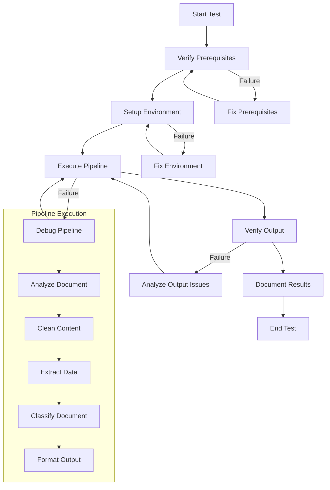

# Document Pipeline Testing and Verification Plan

## 1. Overview

This test plan documents the process for verifying the document processing pipeline functionality using the sample PDF file located at `C:\Repos\FCA-dashboard3\my-full-stack-fastapi-template\utils\pipeline\data\tests\pdf\sample.pdf`. The plan includes environment setup verification, pipeline execution testing, output validation, and documentation of expected results.

## 2. Prerequisites Verification

| ID | Test Case | Expected Result | Status |
|----|-----------|----------------|--------|
| PRE-01 | Verify Python environment (3.8+) | Python version 3.8 or higher is installed | ⬜ |
| PRE-02 | Verify UV package manager | UV is installed and operational | ⬜ |
| PRE-03 | Verify sample PDF file exists | File exists at specified path | ⬜ |
| PRE-04 | Verify output directory exists | Directory exists or can be created | ⬜ |

## 3. Environment Setup Verification

| ID | Test Case | Expected Result | Status |
|----|-----------|----------------|--------|
| ENV-01 | Create virtual environment | Virtual environment created successfully | ⬜ |
| ENV-02 | Activate virtual environment | Environment activated without errors | ⬜ |
| ENV-03 | Install base dependencies | Dependencies installed successfully | ⬜ |
| ENV-04 | Install PDF processing dependencies | PDF dependencies installed successfully | ⬜ |

```bash
# Commands for environment setup
cd utils/pipeline
uv venv
.venv\Scripts\activate
uv pip install -e ".[pdf]"
```

## 4. Pipeline Execution Testing

| ID | Test Case | Expected Result | Status |
|----|-----------|----------------|--------|
| EXEC-01 | Basic pipeline execution | Pipeline processes file without errors | ⬜ |
| EXEC-02 | Pipeline with JSON output | JSON output file created successfully | ⬜ |
| EXEC-03 | Pipeline with Markdown output | Markdown output file created successfully | ⬜ |
| EXEC-04 | Pipeline with processing report | Report generated successfully | ⬜ |

```bash
# Commands for pipeline execution
# Basic execution
python -m utils.pipeline.run_pipeline --file C:\Repos\FCA-dashboard3\my-full-stack-fastapi-template\utils\pipeline\data\tests\pdf\sample.pdf --output C:\Repos\FCA-dashboard3\my-full-stack-fastapi-template\utils\pipeline\data\output

# With multiple output formats
python -m utils.pipeline.run_pipeline --file C:\Repos\FCA-dashboard3\my-full-stack-fastapi-template\utils\pipeline\data\tests\pdf\sample.pdf --output C:\Repos\FCA-dashboard3\my-full-stack-fastapi-template\utils\pipeline\data\output --formats json,markdown

# With processing report
python -m utils.pipeline.run_pipeline --file C:\Repos\FCA-dashboard3\my-full-stack-fastapi-template\utils\pipeline\data\tests\pdf\sample.pdf --output C:\Repos\FCA-dashboard3\my-full-stack-fastapi-template\utils\pipeline\data\output --report C:\Repos\FCA-dashboard3\my-full-stack-fastapi-template\utils\pipeline\data\output\report.json
```

## 5. Output Verification

| ID | Test Case | Expected Result | Status |
|----|-----------|----------------|--------|
| OUT-01 | Verify output files exist | Output files created in specified directory | ⬜ |
| OUT-02 | Verify JSON structure | JSON file contains valid structure with expected fields | ⬜ |
| OUT-03 | Verify document classification | Document classified with reasonable confidence | ⬜ |
| OUT-04 | Verify content extraction | Text content extracted correctly from PDF | ⬜ |
| OUT-05 | Verify metadata extraction | Metadata (title, author, date) extracted if available | ⬜ |

Expected JSON structure fields to verify:
- `document_type`: Classification of the document
- `confidence`: Classification confidence score (0.0-1.0)
- `schema_pattern`: Identified schema pattern
- `metadata`: Document metadata
- `content`: Extracted content sections
- `tables`: Extracted tables (if any)

## 6. Custom Configuration Testing (Optional)

| ID | Test Case | Expected Result | Status |
|----|-----------|----------------|--------|
| CONF-01 | Create custom configuration | Configuration file created successfully | ⬜ |
| CONF-02 | Run pipeline with custom config | Pipeline uses custom configuration | ⬜ |
| CONF-03 | Verify custom settings applied | Output reflects custom configuration settings | ⬜ |

```bash
# Command for custom configuration
python -m utils.pipeline.run_pipeline --file C:\Repos\FCA-dashboard3\my-full-stack-fastapi-template\utils\pipeline\data\tests\pdf\sample.pdf --output C:\Repos\FCA-dashboard3\my-full-stack-fastapi-template\utils\pipeline\data\output --config C:\Repos\FCA-dashboard3\my-full-stack-fastapi-template\utils\pipeline\config\custom_config.yaml
```

## 7. Test Results Documentation

| Field | Value |
|-------|-------|
| Test Date | [DATE] |
| Tester | [NAME] |
| Pipeline Version | [VERSION] |
| Sample Document | sample.pdf |
| Document Type Classification | [RESULT] |
| Classification Confidence | [SCORE] |
| Processing Time | [TIME] |
| Issues Encountered | [ISSUES] |
| Notes | [NOTES] |

## 8. Test Flow Diagram



## 9. Appendix: Expected Classification Results

The sample PDF should be classified into one of the following document types, depending on its content:

- PROPOSAL
- SPECIFICATION
- INVOICE
- REPORT
- CONTRACT
- FORM
- LETTER
- UNKNOWN (if classification confidence is below threshold)

Each classification should include:
- Document type
- Confidence score
- Schema pattern
- Key features detected
- Classifiers used in the ensemble

## 10. Next Steps

After completing this test plan:
1. Document any issues or inconsistencies found
2. Update the pipeline configuration if needed
3. Consider automating this test process
4. Add the sample PDF and its expected results to the test suite

## 11. Execution Script

Below is a PowerShell script that can be used to execute the test plan:

```powershell
# pipeline_test.ps1
# Script to execute the document pipeline test plan

# Set variables
$PIPELINE_DIR = "C:\Repos\FCA-dashboard3\my-full-stack-fastapi-template\utils\pipeline"
$SAMPLE_PDF = "C:\Repos\FCA-dashboard3\my-full-stack-fastapi-template\utils\pipeline\data\tests\pdf\sample.pdf"
$OUTPUT_DIR = "C:\Repos\FCA-dashboard3\my-full-stack-fastapi-template\utils\pipeline\data\output"
$REPORT_PATH = "$OUTPUT_DIR\report.json"

# Create output directory if it doesn't exist
if (-not (Test-Path $OUTPUT_DIR)) {
    New-Item -ItemType Directory -Path $OUTPUT_DIR
    Write-Host "Created output directory: $OUTPUT_DIR"
}

# Verify sample PDF exists
if (-not (Test-Path $SAMPLE_PDF)) {
    Write-Host "Error: Sample PDF not found at $SAMPLE_PDF" -ForegroundColor Red
    exit 1
}

# Navigate to pipeline directory
Set-Location $PIPELINE_DIR

# Check Python version
$pythonVersion = python --version
Write-Host "Using $pythonVersion"

# Run the pipeline with basic settings
Write-Host "Running pipeline with basic settings..." -ForegroundColor Green
python -m utils.pipeline.run_pipeline --file $SAMPLE_PDF --output $OUTPUT_DIR

# Run with multiple output formats
Write-Host "Running pipeline with multiple output formats..." -ForegroundColor Green
python -m utils.pipeline.run_pipeline --file $SAMPLE_PDF --output $OUTPUT_DIR --formats json,markdown

# Run with processing report
Write-Host "Running pipeline with processing report..." -ForegroundColor Green
python -m utils.pipeline.run_pipeline --file $SAMPLE_PDF --output $OUTPUT_DIR --report $REPORT_PATH

# Verify output files
Write-Host "Verifying output files..." -ForegroundColor Green
$outputFiles = Get-ChildItem $OUTPUT_DIR
Write-Host "Found $($outputFiles.Count) files in output directory:"
foreach ($file in $outputFiles) {
    Write-Host "- $($file.Name)"
}

Write-Host "Test execution completed." -ForegroundColor Green
```

## 12. Batch Script Alternative

For those who prefer using batch files, here's an equivalent script:

```batch
@echo off
REM pipeline_test.bat
REM Script to execute the document pipeline test plan

REM Set variables
set PIPELINE_DIR=C:\Repos\FCA-dashboard3\my-full-stack-fastapi-template\utils\pipeline
set SAMPLE_PDF=C:\Repos\FCA-dashboard3\my-full-stack-fastapi-template\utils\pipeline\data\tests\pdf\sample.pdf
set OUTPUT_DIR=C:\Repos\FCA-dashboard3\my-full-stack-fastapi-template\utils\pipeline\data\output
set REPORT_PATH=%OUTPUT_DIR%\report.json

REM Create output directory if it doesn't exist
if not exist %OUTPUT_DIR% (
    mkdir %OUTPUT_DIR%
    echo Created output directory: %OUTPUT_DIR%
)

REM Verify sample PDF exists
if not exist %SAMPLE_PDF% (
    echo Error: Sample PDF not found at %SAMPLE_PDF%
    exit /b 1
)

REM Navigate to pipeline directory
cd %PIPELINE_DIR%

REM Check Python version
python --version

REM Run the pipeline with basic settings
echo Running pipeline with basic settings...
python -m utils.pipeline.run_pipeline --file %SAMPLE_PDF% --output %OUTPUT_DIR%

REM Run with multiple output formats
echo Running pipeline with multiple output formats...
python -m utils.pipeline.run_pipeline --file %SAMPLE_PDF% --output %OUTPUT_DIR% --formats json,markdown

REM Run with processing report
echo Running pipeline with processing report...
python -m utils.pipeline.run_pipeline --file %SAMPLE_PDF% --output %OUTPUT_DIR% --report %REPORT_PATH%

REM Verify output files
echo Verifying output files...
dir %OUTPUT_DIR%

echo Test execution completed.
